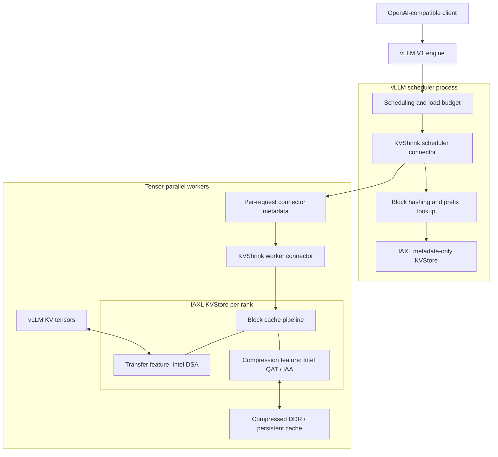
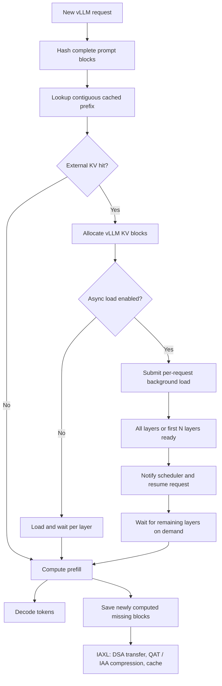

# KVShrink Design

## Purpose

KVShrink is a reference vLLM V1 KV-cache connector built on IAXL. It shows how a serving runtime can reuse prompt KV blocks from host memory or persistent storage while Intel Data Streaming Accelerator (DSA) and Intel QuickAssist Technology (QAT) or Intel In-Memory Analytics Accelerator (IAA) optimize the data path.

Within this Intel reference solution, KVShrink is the framework integration and IAXL is the reusable acceleration layer. KVShrink owns vLLM request and layer semantics; IAXL owns block transfer, compression, and storage.

## Architecture

The scheduler-side connector runs `KVStore` in metadata-only mode. It hashes complete prompt blocks, finds the longest contiguous external-cache prefix, allocates vLLM KV blocks, and sends load/save metadata to workers. Each worker binds its rank-local vLLM KV tensors to a full IAXL `KVStore`.

## Request Flow

The scheduler returns both the number of externally cached tokens and whether the request should load asynchronously. Synchronous requests are merged into a load batch. Asynchronous requests retain separate task state so each request can be resumed independently.

With early-layer promotion, the worker reports a load complete after the first configured layers are ready. vLLM can then begin prefill while IAXL continues loading later layers; `wait_for_layer_load()` enforces the dependency immediately before each layer consumes its KV data.

## Layer-Pipelined Load

A load request covers all layers, but each layer moves through the stages independently: decompress into pinned CPU buffers, transfer into the KV tensor, then mark the layer ready. Each stage is serial within its own lane, while the lanes run concurrently on different layers.

```mermaid
gantt
    title Per-layer pipeline: load of layer i+1 runs while the GPU computes layer i
    dateFormat X
    axisFormat %s
    tickInterval 1second
    section QAT / IAA
    Unzip KV L1 :a1, 0, 1s
    Unzip KV L2 :a2, after a1, 1s
    Unzip KV L3 :a3, after a2, 1s
    Unzip KV L4 :a4, after a3, 1s
    section DSA
    H2D KV L1 :b1, after a1, 1s
    H2D KV L2 :b2, after a2, 1s
    H2D KV L3 :b3, after a3, 1s
    H2D KV L4 :b4, after a4, 1s
    section GPU
    Prefill L1 :c1, after b1, 2s
    Prefill L2 :c2, after c1, 2s
    Prefill L3 :c3, after c2, 2s
```

Only the leading layers sit on the TTFT critical path. Once the request is promoted, prefill of layer *i* proceeds while DSA moves layer *i+1* and QAT or IAA decompresses layer *i+2*, so decompression and transfer latency is hidden behind compute and the pipeline advances at the rate of its slowest stage instead of the sum of the three.

## Intel Accelerator Optimizations

- **Intel DSA accelerates KV movement.** IAXL batches fragmented KV regions and uses DSA with GDRCopy for H2D and D2H transfers on supported CUDA systems. This reduces CPU-driven copy overhead and makes host-backed cache reuse more practical.
- **Intel QAT and Intel IAA reduce cache size.** KV blocks are compressed on dedicated accelerators before entering the host cache. The smaller representation raises effective DDR capacity and lowers persistence bandwidth.
- **Minimal compute interference.** Compression and decompression run asynchronously on QAT or IAA, so cache-size reduction adds little pressure to inference CPU resources and is designed to have minimal impact on model execution performance.

## Data-Path Optimizations

- **Decompression-inference overlap:** KVShrink starts prefill after the configured leading KV layers are ready, while IAXL continues decompressing and loading later layers in parallel with inference.
- **Adaptive asynchronous loading:** `KVSHRINK_VLLM_KV_ASYNC_LOAD_ENABLED` enables background loading, while `KVSHRINK_VLLM_KV_ASYNC_LOAD_LAYERS_DYNAMIC_MAP` selects synchronous or layer-gated asynchronous loading for each request-concurrency range.
- **Layer-level overlap:** `KVSHRINK_VLLM_KV_ASYNC_LOAD_LAYERS` controls when a partially loaded request may resume.
- **Rank-local affinity:** CPU cores, QAT or IAA devices, and DSA work queues are assigned per tensor-parallel rank to preserve NUMA locality.

The dynamic layer map uses contiguous inclusive concurrency ranges. It must
start at zero and end with an open range. For example,
`0-3:0,4-6:4,7-:8` selects synchronous loading for concurrency 0–3, waits for
four layers at concurrency 4–6, and waits for eight layers at concurrency 7 or
higher. A layer value of zero means synchronous loading for that range.
