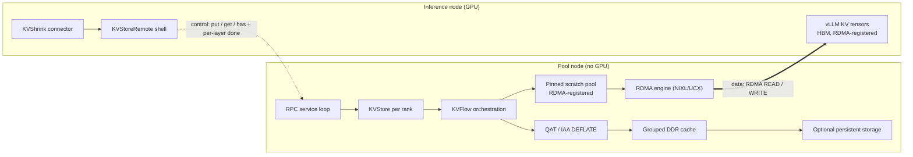

# Remote Pool Design

## Purpose

Remote Pool turns IAXL into a cross-node KV cache pool. The full `KVStore` (KVFlow, scratch pool, compression, DDR cache, persistence) runs in a daemon on a separate memory node, while the vLLM worker keeps only a thin `KVStoreRemote` shell that exposes the same block API. `IAXL_RDMA_ENABLE` selects the remote shell instead of the local store, so connectors and benchmarks are unchanged.

- **GPU-Direct RDMA data path.** The daemon initiates every transfer against the worker's registered KV tensors: `PUT` is an RDMA READ of worker HBM, `GET` is an RDMA WRITE into worker HBM. The inference node never copies KV data, needs no scratch pool, and needs no extra GPU copy stream.
- **Accelerator-backed compression on the pool node.** KV blocks are compressed with Intel QAT or Intel In-Memory Analytics Accelerator (IAA) DEFLATE before entering the pooled DDR cache, so pooled capacity is amplified without spending inference-node cycles.
- **Capacity decoupled from the inference node.** DDR and persistent capacity scale on memory-rich pool nodes, and several inference nodes can be served by pool nodes sized independently of the GPU fleet.

## Architecture

The control plane carries only descriptors. A request is an RDMA write of its binary payload (block indices, block hashes, layer indices) into the daemon's registered control buffer, followed by a notification, so the header always arrives after the payload has landed. Responses and per-layer completions travel back as notifications; `put_wait()` and `get_wait()` are local dictionary lookups on the worker and never cross the network.

The daemon mirrors the vLLM process topology: one rank process per tensor-parallel rank, each bound to its own CPU cores and accelerator instances, plus one metadata-only scheduler process that answers prefix `has()` lookups from the vLLM scheduler.

## Layer-Pipelined Load

A `GET` covers all layers of a request, but the daemon treats each layer as an independent job stage: decompress into pinned buffers, RDMA WRITE into the worker's KV tensor, then push a `done(job, layer)` notification. Decompression of later layers overlaps with the RDMA of earlier layers and with GPU prefill already running on the worker.

```mermaid
gantt
    title Per-layer pipeline: load of layer i+1 runs while the GPU computes layer i
    dateFormat X
    axisFormat %s
    tickInterval 1second
    section QAT / IAA
    Unzip KV L1 :a1, 0, 1s
    Unzip KV L2 :a2, after a1, 1s
    Unzip KV L3 :a3, after a2, 1s
    Unzip KV L4 :a4, after a3, 1s
    section RDMA
    Transfer KV L1 :b1, after a1, 1s
    Transfer KV L2 :b2, after a2, 1s
    Transfer KV L3 :b3, after a3, 1s
    Transfer KV L4 :b4, after a4, 1s
    section GPU
    Prefill L1 :c1, after b1, 2s
    Prefill L2 :c2, after c1, 2s
    Prefill L3 :c3, after c2, 2s
```

Each stage is serial within its own lane — one unzip at a time on the accelerators, one write at a time on the NIC, one layer at a time on the GPU — but the three lanes run concurrently on different layers: prefill of layer *i* starts as soon as the RDMA write of layer *i* lands, while the NIC writes layer *i+1* and the accelerators decompress layer *i+2*. The GPU lane therefore stays contiguous and the pipeline advances at the rate of its slowest stage instead of the sum of the three.

Only the first layers sit on the TTFT critical path. Once KVShrink promotes the request after the configured leading layers are ready, prefill advances layer by layer while the daemon keeps filling the layers ahead of it, hiding decompression and network latency behind compute. `wait_for_layer_load()` enforces the dependency per layer without an RPC round trip.

`PUT` follows the mirror image: the worker synchronizes the current stream once, the daemon reads each layer out of HBM as attention finishes it, then compresses and inserts it into the pooled cache asynchronously.

## Intel Accelerator Optimizations

- **Intel QAT and Intel IAA expand pooled capacity.** DEFLATE runs on dedicated accelerators on the pool node with many operations in flight, so the compression ratio directly multiplies usable DDR capacity and cuts persistence traffic.
- **Accelerators overlap with the network.** Unzip of layer *i+1* proceeds on QAT/IAA while layer *i* is on the wire, which is what makes the per-layer pipeline keep pace with prefill.
- **Topology-aware binding.** Each daemon rank process is pinned to local cores, QAT or IAA instances, and the RDMA NIC that owns its address, preserving NUMA locality end to end.
