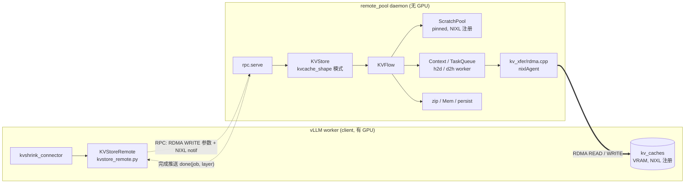
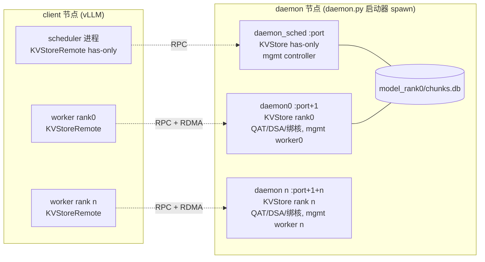

# Remote Pool 设计文档：daemon 侧 KVStore + RDMA 数据面

状态：**草案，待确认后再改代码。**

## 1. 目标

把整个 `KVStore`（含 `KVFlow`、`ScratchPool`、压缩、DRAM 池、持久化）搬到远端 daemon 进程运行；
vLLM worker（client）只保留一个薄壳 `kvstore_remote.py`，接口与现有 `KVStore` 完全一致，内部全部通过 RPC 转发到 daemon。
KV cache 的搬运由 **daemon 侧发起 RDMA**（put = daemon `READ` client 显存，get = daemon `WRITE` client 显存），
client 完全不参与数据面，也不需要 GPU 拷贝流。



## 2. 关键设计决策

| # | 决策 | 理由 |
|---|------|------|
| 1 | daemon 发起 RDMA，client 被动 | client 只需注册显存 + RPC，无 GPU 拷贝流、无 scratch pool；数据面全部在 daemon 的 worker 线程里跑，天然脱离 Python 主线程 |
| 2 | `kv_xfer/rdma.cpp` 作为一个新的 **device backend**（`DEVICE=rdma`），完整实现 `kv_xfer.h` | `Context`、`TaskQueue`、`xfer.cpp`、`flow.py` 的调用链不变；daemon 无 GPU，`cuda.cpp` 不参与编译；client 仍用 `DEVICE=cuda` 构建，零改动 |
| 3 | daemon 侧 `nixlAgent` 由 C++ 持有（单例），通过 pybind 暴露注册 / 通知接口给 Python | 数据面（post/poll）与 pool 注册必须在同一个 agent 上；RPC 通知也复用该 agent，一个进程一个 agent |
| 4 | client 侧继续用 Python `nixl_impl.rdma_xfer` | client 只做注册和 RPC，Python 性能足够；无需在 vLLM 进程里引入新 C++ 依赖 |
| 5 | RDMA 完成用 worker 线程同步 post + poll（同 `dsa.cpp`） | `copy_chunks_batch` 返回即数据落地，`xfer_finish` / `event_synchronize` 语义不变 |
| 6 | 地址 = base + block_idx × stride，不做块拷贝 / 不做 gather | 与现有 `cuda.cpp`/`dsa.cpp` 完全同构；desc 用 `prepXferDlist` 预建索引，每批只传索引数组 |
| 7 | RPC 参数走**注册好的控制缓冲区**（RDMA WRITE + 附带 notif），二进制编码，不用 JSON | notif 设计上是小消息；`block_indices/block_hashs` 可达几百 KB，一次 WRITE 落地后 notif 才送达，天然有序，无二次同步 |
| 8 | 完成状态由 daemon **推送**，client 本地查表；`put_wait/get_wait` 不发 RPC | `wait_for_layer_load` 每层一次 wait，推送后变成本地字典查询；`wait=True` 自旋 `_drain()`（本地 progress，非网络往返） |
| 9 | client 与 daemon 都是**单线程 + 零锁**：所有 agent/buf/字典访问都在各自主线程 | client 同步、单 outstanding；daemon handler 永不阻塞，主循环兼做 RPC 分发与完成轮询；C++ worker 只置 flag，不碰 agent |
| 10 | `KVStoreRemote.put()` 发 RPC 前 `torch.cuda.current_stream().synchronize()` 一次 | daemon READ 之前必须保证 attention kernel 已写完 kv_layer；put 只发生在 prefill，TTFT 数百 ms 量级，一次同步可接受 |
| 11 | daemon 进程拓扑**与非 remote 模式一致**：`tp_size` 个 rank 进程 + 1 个 scheduler（has-only）进程；scheduler 也走 RPC | `chunks.db`（`model_rank0`）、mgmt controller/worker HTTP、绑核/绑加速器全部原样搬到 daemon 节点；client 侧的 scheduler `has()` 与 worker 看到同一份元数据 |

## 3. 各组件

### 3.1 client：`iaxl/remote_pool/kvstore_remote.py`

```python
class KVStoreRemote:
    LABEL = "kv"
    def __init__(self, model_name, block_dim, kv_caches, rank=0, tp_size=1,
                 daemon_ip=None, daemon_port=None):
        # worker 模式（kv_caches 非空）：
        # 1. rdma_xfer(name=f"client{rank}") ; connect(daemon_ip, rank_port(rank))
        # 2. register_kv_caches(kv_caches)  -> 本地 NIXL 注册 + RPC "register_kv_caches"
        # 3. self.layer_names, self.kvcache_shape, self.block_shape 与 KVStore 保持一致
        # has-only 模式（kv_caches=None, layer_names 非空，vLLM scheduler 进程）：
        # 1. rdma_xfer(name="client_sched") ; connect(daemon_ip, daemon_port)   # 只注册 ctrl_buf
        # 2. RPC "register_layers"(layer_names, model_name, tp_size)
    def register_kv_caches(self, kv_caches: Dict[str, torch.Tensor]) -> None
    def put(block_indices, block_hashs, layer_names=None, description="") -> Dict[str, RemoteTask]
        # torch.cuda.current_stream().synchronize() 一次，再 RPC put -> job_id
    def put_wait(put_results, layer_names=None, wait=True) -> bool      # 本地查 _done，不发 RPC
    def get(block_indices, block_hashs, layer_names=None, description="") -> Dict[str, RemoteTask]
    def get_wait(get_results, layer_names=None, wait=True) -> bool      # 同上
    def has(block_hashs) -> List[bool]
    def stop() ; status() ; metrics(params) ; persist(n) ; evict(n)
    def get_persist_candidates(n) ; get_evict_candidates(n)

    _done: Dict[int, Set[int]]      # job_id -> 已完成的层索引，由 _drain() 填充
    def _drain(self):               # get_new_notifs() 一次，按类型路由：RPC 响应 / done 推送

@dataclass
class RemoteTask:            # 替代 kvflow.Task，只有句柄
    job_id: int
    tensor_key: str
```

* `put/get` 的返回值形状仍是 `Dict[layer_name, task]`，connector 代码（`tasks[0]`、`put_wait(tasks, wait=False)` 等）无需改动。
* `put()`：先 `torch.cuda.current_stream().synchronize()`（保证 kernel 已写完 kv_layer，daemon 才能 READ），再 RPC。
* `put_wait/get_wait(results, layer_names, wait)`：取 `results` 中任一 `job_id`，`_drain()` 一次后查 `_done[job_id]` 是否覆盖所需层；
  `wait=True` 时 `while not ready: _drain()` 自旋（每次 `get_new_notifs()` 只是一次本地 `ucp_worker_progress`，1–3 µs）。全部层完成后 `del _done[job_id]`。
* 所有方法都由 vLLM worker 的同一个线程调用（`start_load_kv / wait_for_layer_load / save_kv_layer / get_finished`），`_done`、agent、控制 buf 无并发访问，不需要锁。
* `has()` 直接 RPC。**has-only 模式（vLLM scheduler 进程）也走 RPC**：`KVStoreRemote(model_name, layer_names=[...], tp_size)` 连 daemon 的 scheduler 进程（端口 `daemon_port`），
  不注册显存，`put/get/put_wait/get_wait/persist/evict` 与原 `KVStore` 一样报 `RuntimeError`/返回 error；`has/status/stop/get_*_candidates` 透传。
  `has()` 在 scheduler 关键路径上（每个新请求一次），比原来多一次 RPC 往返（~50 µs），可忽略。

### 3.2 client：`iaxl/remote_pool/rpc.py`（扩展）

现有 `KVClient` 改名/演化为 `RpcChannel`，供 `KVStoreRemote` 使用。传输层见 §3.8。消息表：

| 消息 | 方向 | 参数 | 说明 |
|------|------|------|------|
| `register_kv_caches` | C→D | `layers: {name: {base, shape, dtype, dev_id}}`, `block_dim`, `model_name`, `rank`, `tp_size` | worker → rank 进程。一次 RPC 传全部层；daemon 据此 `fetchRemoteMD` + 建 remote dlist + 构造 `KVStore`；响应里带 daemon 控制 buf 的地址 |
| `register_layers` | C→D | `layer_names`, `model_name`, `tp_size` | vLLM scheduler → daemon scheduler 进程。daemon 构造 has-only `KVStore(model_name, layer_names=..., tp_size)`；响应带控制 buf 地址 |
| `put` | C→D | `block_indices: int32[]`, `block_hashs: bytes[N][H]`, `layer_idx: int16[]`, `description` | 返回 `job_id`（放在响应 notif 内） |
| `get` | C→D | 同上 | 返回 `job_id` |
| `done` | **D→C 推送** | `job_id, layer_idx` | daemon 每完成一层发一条；client `_drain()` 写入 `_done` |
| `has` | C→D | `block_hashs` | 返回位图（notif 内） |
| `status/metrics/persist/evict/get_*_candidates/stop` | C→D | 原参数（JSON 即可，非热路径） | 大结果 WRITE 到 client `resp` slot |
| `unregister` | C→D | — | daemon 释放 remote dlist、`invalidateRemoteMD` |

`put_wait/get_wait` **没有对应消息**：完全由 client 本地根据 `done` 推送判断。

### 3.3 daemon：`iaxl/remote_pool/daemon.py`（改造）

```python
def main():                              # 启动器：拓扑与非 remote 模式一致
    args = parse(--ip, --port, --tp-size)          # 默认取 IAXL_RDMA_DAEMON_PORT / IAXL_RDMA_TP_SIZE
    ctx = multiprocessing.get_context("spawn")     # UCX/torch 初始化后不能 fork
    procs = [ctx.Process(target=serve_rank, args=(r, args.tp_size, args.ip, rank_port(args.port, r)))
             for r in range(args.tp_size)]
    procs.append(ctx.Process(target=serve_scheduler, args=(args.tp_size, args.ip, args.port)))
    start all; 转发 SIGTERM/SIGINT; 任一子进程退出则整体退出

def serve_rank(rank, tp_size, ip, port):
    bind_cpu_affinity(rank, tp_size)     # 同 connector._bind_cpu_affinity：读 VLLM_CPU_OMP_THREADS_BIND 的第 rank 段
    bind_intel_accel(rank)               # 同 connector._bind_intel_accel：KVSHRINK_QAT_DEVICES/KVSHRINK_DSA_DEVICES → IAXL_QAT_DEVICES/IAXL_DSA_WQS
    configure_ucx_env(local_ip=ip)       # 由 IAXL_RDMA_DAEMON_IP 自动定位 NIC → UCX_NET_DEVICES
    rdma = torch_ext.rdma_init(name=f"daemon{rank}", port)   # C++ agent
    service = KVStoreService(role="worker", rank=rank)        # KVStore 在 register_kv_caches 时才创建
    rpc.serve(rdma, service)             # 单线程主循环，见下

def serve_scheduler(tp_size, ip, port):
    configure_ucx_env(local_ip=ip)       # 不绑核、不绑加速器，同原 scheduler 进程
    rdma = rdma_xfer(name="daemon_sched", listen_port=port)  # 无数据面，Python nixl 即可
    service = KVStoreService(role="controller")               # KVStore(has-only) 在 register_layers 时创建
    rpc.serve(rdma, service)

# rpc.serve 主循环（每个 daemon 进程的主线程，唯一碰 agent / KVFlow 的线程）
while True:
    for msg in rdma_get_notifs():        # 1. 收 RPC，dispatch 到 handler（handler 永不阻塞）
        service.dispatch(msg)
    for job in service.pending():        # 2. 轮询未完成的 (job, layer)
        for layer in job.not_done:
            if kvstore.X_wait(job.tasks, [layer], wait=False):   # zip_is_complete / event_query，非阻塞
                kvstore.X_wait(job.tasks, [layer], wait=True)    # 已完成，立即返回：释放 pool block
                rdma_send_notif(job.peer, done(job.id, layer))   # 3. 推送
                job.not_done.remove(layer)
        if not job.not_done: del jobs[job.id]
    # 有 pending 时忙轮询；空闲时 spin N µs 后短暂 sleep 降 CPU
```

`KVStoreService` handlers：

| handler | 做什么 |
|---------|--------|
| `register_kv_caches(peer, layers, block_dim, model_name, rank, tp_size)` | ① `torch_ext.rdma_add_peer(peer)`（fetchRemoteMD）② 每层 `torch_ext.rdma_register_remote(peer, base, shape, dtype, dev_id)` → 返回 `RemoteTensor` ③ `KVStore(model_name, block_dim, kv_caches={name: RemoteTensor}, rank, tp_size)` ④ 首次调用后 `ScratchPool` 建好即 `torch_ext.rdma_register_local(pool.pool)` |
| `register_layers(peer, layer_names, model_name, tp_size)` | 仅 scheduler 进程：`KVStore(model_name, layer_names=layer_names, tp_size=tp_size)`（has-only，`persist_dir=model_rank0`，与 rank0 进程共享 `chunks.db`，完全同原来） |
| `put(...)` | `job_id = next_id(); jobs[job_id] = Job(peer, kvstore.put(...), not_done=layers)`; 返回 `job_id` |
| `get(...)` | 同上 |
| 其它 | 透传 |

**没有 `put_wait/get_wait` handler**：完成检测和 pool 回收在主循环第 2 步做，daemon 侧从不 `event_synchronize` / `zip_wait` 阻塞。
单 client 的 RPC 是同步单 outstanding 的，处理一个 `put`（64 层 Python 编排约 3–6 ms）期间不会有第二个 RPC 到达，因此不需要独立 RPC 线程；
重活（RDMA post/poll、zip、memcpy）都在 C++ `TaskQueue`/OMP 线程且释放 GIL。

### 3.4 daemon：`iaxl/kvstore/kvstore.py`（小改）

`kv_caches` 的 value 允许是 `RemoteTensor`（只需 `.shape`、`.dtype`）。现有代码只用了 `first_tensor.shape`，
所以 **`__init__` 无需改签名**，只是类型放宽为 `Dict[str, Union[torch.Tensor, RemoteTensor]]`。
用户要求的“接口接收 `kvcache_shape`”通过 `RemoteTensor`（shape + dtype + 远端地址）承载，比单独传 shape 更完整。

### 3.5 daemon：`iaxl/kvflow/flow.py`（小改）

| 位置 | 改动 |
|------|------|
| `put()/get()` 入口断言 | `tensor.is_cuda or tensor.is_xpu` → `or isinstance(tensor, RemoteTensor)`；`device/contiguous` 断言对 RemoteTensor 跳过 |
| `Context.create(tensor, ...)` | 对 RemoteTensor 调 `Context.create_remote(rt.base, rt.dev_id, rt.shape, rt.dtype, chunk_dim, direction, name)` |
| `ctx.xfer_wait_cur_stream(sync_cur_stream=True)` | RemoteTensor 时跳过（daemon 无 GPU stream） |
| `_ensure_streams()` | `get_accelerator_device()` 为 None 时 `put_stream/get_stream = None` |
| `_ensure_pool()` | 建池后若 `envs.IAXL_RDMA_ENABLE` 调 `torch_ext.rdma_register_local(pool.pool)` |

`RemoteTensor` 定义放在 `iaxl/kvflow/remote_tensor.py`：

```python
@dataclass(frozen=True)
class RemoteTensor:
    peer: str
    base: int              # 远端 VRAM 虚拟地址
    shape: Tuple[int, ...]
    dtype: torch.dtype
    dev_id: int
    def element_size(self); def dim(self); def stride(self, d)   # contiguous 假设
```

### 3.6 daemon：`iaxl/csrc/kv_xfer/rdma.cpp`（新增，实现 `kv_xfer.h`）

CMake：`if(DEVICE STREQUAL "rdma")` → 编译 `rdma.cpp`，定义 `RDMA_SUPPORT`，链接 `nixl`（`find_library(NIXL nixl)` + `include/nixl.h`），不链接 CUDA。

```cpp
// ---- kv_xfer.h 现有接口，语义映射 ----
context_t context_create(char *gpu_base_ptr /*=远端 base*/, int device_index /*=远端 dev*/,
                         int64_t chunk_stride, int64_t outer_dims, int64_t inner_size,
                         int64_t outer_block_size, stream_t /*ignored*/);
//   -> 通过 gpu_base_ptr 查 remote 表得到 (peer, remote_dlist_h, num_blocks)
void copy_chunks_batch(context_t, const std::vector<int64_t> &chunk_indices,
                       const std::vector<char *> &cpu_ptrs, bool h2d);
//   -> rdma_copy_chunks_batch(...) 同步：makeXferReq + postXferReq + 轮询 getXferStatus
event_t event_acquire(); void context_record_event(ctx, ev);   // ev = atomic flag，在 worker 线程置位
void event_synchronize(ev); bool event_query(ev);              // 等 flag
uint64_t context_stream_id(ctx);                                // 返回 0

// ---- 新增，iaxl/csrc/include/kv_xfer_rdma.h，pybind 到 torch_ext ----
void  rdma_init(const std::string &name, int port);            // 创建 nixlAgent(UCX), 起 listen 线程
void  rdma_add_peer(const std::string &peer);                  // fetchRemoteMD + 等待
void  rdma_register_local(char *base, size_t bytes, int64_t block_bytes, int64_t outer_dims, int64_t inner_size);
//   -> registerMem(DRAM) + prepXferDlist(NIXL_INIT_AGENT)：每个 pool block 拆成 outer_dims 个 inner_size 子描述符
uintptr_t rdma_register_remote(const std::string &peer, uintptr_t base, const std::vector<int64_t> &shape,
                               int64_t elem_size, int dev_id, int chunk_dim);
//   -> prepXferDlist(peer, VRAM)：desc[o*num_blocks + b] = base + o*outer_block_size + b*chunk_stride, len=inner_size
//   -> 记录 base -> {peer, dlist_h, num_blocks}; 返回 base 作为 context_create 的 gpu_base_ptr
void  rdma_unregister_remote(uintptr_t base); void rdma_remove_peer(peer);
void  rdma_send_notif(peer, bytes); std::vector<std::pair<std::string,std::string>> rdma_get_notifs();
```

`rdma_copy_chunks_batch` 的地址计算（设计点 3）：

```
输入：chunk_indices[i]（client 侧 block_idx）, cpu_ptrs[i]（pool 中某 block 的地址）, h2d
对每个 i, 对每个 o in [0, outer_dims):
    remote_addr = remote_base + o * outer_block_size + chunk_indices[i] * chunk_stride    # 长度 inner_size
    local_addr  = cpu_ptrs[i]  + o * inner_size
    remote_idx  = o * num_blocks + chunk_indices[i]                                       # prepped remote dlist 索引
    local_idx   = ((cpu_ptrs[i] - pool_base) / block_bytes) * outer_dims + o              # prepped local dlist 索引
op = h2d ? NIXL_WRITE : NIXL_READ         # h2d = get(daemon→client 显存)，d2h = put(client 显存→daemon)
h = makeXferReq(op, local_dlist_h, local_idx[], remote_dlist_h, remote_idx[]) ; postXferReq(h)
while getXferStatus(h) == NIXL_IN_PROG ;  releaseXferReq(h)
```

以现有 `[2, num_blocks, 16, 4, 128] bf16, chunk_dim=1` 为例：`outer_dims=2, inner_size=chunk_stride=16 KiB, outer_block_size=num_blocks×16 KiB`，
每个 block 产生 2 个 16 KiB 描述符（K、V 各一个）。相邻 block 索引连续时可合并为一个描述符（优化项，见 §7）。

### 3.7 `iaxl/csrc/torch_ext/context.h`

新增 `Context::create_remote(uintptr_t base, int dev_id, shape, elem_size, chunk_dim, direction, name)`：
按 contiguous 计算 `chunk_stride/outer_dims/inner_size/outer_block_size`，调 `kv_xfer::context_create((char*)base, dev_id, ...)`。
`gpu_tensor_` 留空；`xfer_wait_cur_stream` 在 `RDMA_SUPPORT` 下为 no-op。

### 3.8 RPC 传输层与线程模型

**控制缓冲区**（两侧 `RpcChannel` 各一块）：

```
ctrl_buf: pinned uint8[CTRL_BYTES]  (如 2×4 MB)，register_memory 一次
  [ req slot | resp slot ]
```

| 步骤 | 做法 |
|------|------|
| 握手 | `register_kv_caches` 时 client 把自己的 ctrl_buf 地址随 layers 一起发；daemon 在响应里回自己的；两侧 `prep_dlist` 对方 slot |
| 请求 C→D | client 把 header+payload pack 进本地 `req` slot → `WRITE` 到 daemon 的 `req` slot，`notif_msg = (method_id, seq, payload_len)` 附在同一个 xfer 上。NIXL 保证 notif 在数据落地之后送达，daemon 收到即可直接读本地 slot |
| 响应 D→C | 小结果（`job_id`、`bool`、位图）直接放 notif；大结果（`status/metrics`）`WRITE` 到 client `resp` slot + notif |
| 推送 D→C | `done(job_id, layer_idx)` 只用 notif，不碰 buf |
| 编码 | 热路径无 JSON：`block_indices` → `int32[]`，`block_hashs` → 定长 bytes，`layer_names` → `int16` 层索引（两侧 `layer_names` 顺序一致）；用 `numpy` 视图直接写 pinned buf |
| slot 复用 | client 同步、单 outstanding：收到响应前不会重写 `req`；daemon 主循环单线程：读完再收下一条。将来要 pipelining 再改成带 seq 的 ring |

**线程模型**：

| 侧 | 线程 | 职责 |
|----|------|------|
| client | vLLM worker 主线程（connector 调用线程） | 全部 `KVStoreRemote` 方法、`_drain()`、agent、ctrl_buf、`_done` |
| client | NIXL listen 线程（内部） | 只做 metadata 交换，NIXL 自身保证安全 |
| daemon | 主线程 | `serve` 循环：收 RPC → handler（非阻塞）→ 轮询 `X_wait(wait=False)` → 推送 `done` |
| daemon | C++ `h2d/d2h TaskQueue` worker | `rdma_copy_chunks_batch`：post + poll，完成后置 event flag；**不调用 agent 的 notif/metadata 接口**（agent 的 xfer 接口与主线程的 notif 接口并发使用需要 NIXL 线程安全模式，见 §7.8） |
| daemon | OMP / omp_queue | zip / unzip |

**put 的 GPU 就绪保证**：原 `flow.put` 用 `xfer_wait_cur_stream(sync_cur_stream=True)` 把 D2H 拷贝排在 attention kernel 之后；
改为 daemon 发起 READ 后，由 `KVStoreRemote.put()` 在 RPC 之前 `torch.cuda.current_stream().synchronize()` 一次来保证。
put 只在 prefill 阶段发生，TTFT 本身数百 ms 以上，这次同步可接受。

**get 的可见性保证**：daemon 在 `getXferStatus == DONE`（RC ACK 表示数据已写入 client 内存）之后才发 `done`，client 收到 `done` 时显存数据已可见，无需任何 stream 同步。

### 3.9 进程拓扑、端口与绑核

非 remote 模式下，vLLM 每个 TP rank 的 worker 进程各持有一个 `KVStore`，scheduler 进程持有一个 has-only `KVStore`（与 rank0 共享 `model_rank0/chunks.db`）。
remote 模式下这套拓扑原样搬到 daemon 节点，client 侧每个进程对应连到 daemon 侧的同角色进程：



| 角色 | client 进程 | daemon 进程 | 端口（NIXL listen = RPC） |
|------|------------|------------|------|
| scheduler | `KVStoreRemote(layer_names=...)` | `serve_scheduler`：has-only `KVStore` + mgmt controller（`IAXL_API_CONTROLLER_PORT`） | `port` |
| rank r | `KVStoreRemote(kv_caches=...)` | `serve_rank(r)`：`KVStore(rank=r)` + mgmt worker（`IAXL_API_WORKER_BASE_PORT + r`） | `port + 1 + r` |

* `rank_port(port, r) = port + 1 + r`：用“`port + r`”会让 rank0 与 scheduler 撞端口，所以 rank 从 `port + 1` 起。
* `daemon.py` 以 `--tp-size`（或 `IAXL_RDMA_TP_SIZE`）启动 `tp_size + 1` 个子进程（`spawn`），client 侧 `tp_size` 必须一致（`register_*` 时校验）。
* **绑核 / 绑加速器**：`serve_rank` 复用 connector 的 `_bind_cpu_affinity` / `_bind_intel_accel` 逻辑，环境变量名不变（`VLLM_CPU_OMP_THREADS_BIND`、`KVSHRINK_QAT_DEVICES`、`KVSHRINK_DSA_DEVICES`，用 `|` 按 rank 分段），现有启动脚本直接在 daemon 节点使用。
  实现上把这两个函数提到 `iaxl/utils/affinity.py`（`bind_cpu_affinity(rank, tp_size, spec)`、`bind_intel_accel(rank)`），connector 和 daemon 共用，避免两份拷贝。
* remote 模式下 vLLM worker 不再跑压缩/DSA，connector 的 `_bind_cpu_affinity/_bind_intel_accel` 在 `IAXL_RDMA_ENABLE=1` 时跳过（否则会把 vLLM worker 限制在压缩用的 CPU 上）。
* mgmt HTTP API（`/v1/cache/*`）仍由 `KVStore.__init__` 启动，只是现在监听在 daemon 节点；运维工具改指向 daemon 节点 IP。

### 3.10 NIC 自动检测（`nixl_impl.configure_ucx_env`）

不再硬编码 `RDMA_NIC` / 不定义 `IAXL_RDMA_NIC`。两侧各用自己的 IP 找到 RDMA 网口：

```python
def configure_ucx_env(local_ip: str) -> str:
    netdev = netdev_of_ip(local_ip)        # 遍历 /sys/class/net/*，用 getifaddrs/`ip -j addr` 找持有 local_ip 的接口
    ibdev  = sorted(os.listdir(f"/sys/class/net/{netdev}/device/infiniband"))[0]   # 现有逻辑
    os.environ.setdefault("UCX_NET_DEVICES", f"{ibdev}:1")
    os.environ.setdefault("UCX_TLS", "rc,cuda_copy,cuda_ipc")
    return ibdev
```

| 侧 | `local_ip` 来源 | 对端 |
|----|----------------|------|
| daemon（`serve_rank` / `serve_scheduler`） | `IAXL_RDMA_DAEMON_IP`（`--ip` 可覆盖），同时作为 NIXL listen 地址 | — |
| client（`KVStoreRemote`） | `IAXL_RDMA_CLIENT_IP` | `IAXL_RDMA_DAEMON_IP:port` |

* 需在 `import nixl` / `rdma_init` 之前调用（UCX 只在初始化时读环境变量）。
* 找不到持有该 IP 的接口、或该接口没有 `device/infiniband`（不是 RDMA 网口）时直接报错，不回退到 TCP。
* 若用户已手动设了 `UCX_NET_DEVICES`，`setdefault` 不覆盖，可作为多 NIC 等特殊场景的逃生口。
* `IAXL_RDMA_CLIENT_IP` 目前只用于选 NIC；NIXL 金属数据里的 UCX 地址由 UCX 自己生成，daemon 不需要知道 client IP。

## 4. 流程图

### 4.1 注册

```mermaid
sequenceDiagram
    participant Conn as kvshrink_connector
    participant KR as KVStoreRemote (client)
    participant NX as nixl (client py)
    participant RPC as daemon rpc.serve
    participant SVC as KVStoreService
    participant CXX as torch_ext.rdma_* (C++)
    Conn->>KR: KVStoreRemote(model, block_dim, kv_caches, rank)
    KR->>NX: rdma_xfer(); connect(daemon_ip, port)
    loop 每层
        KR->>NX: register_memory(kv_caches[name])  (VRAM)
    end
    KR->>NX: send_local_metadata(daemon)
    KR->>RPC: register_kv_caches(layers{base,shape,dtype,dev}, block_dim, model, rank, tp)
    RPC->>SVC: handler
    SVC->>CXX: rdma_add_peer(client)  (fetchRemoteMD)
    loop 每层
        SVC->>CXX: rdma_register_remote(peer, base, shape, ...) -> RemoteTensor
    end
    SVC->>SVC: KVStore(kv_caches={name: RemoteTensor})
    SVC->>CXX: rdma_register_local(ScratchPool.pool) (首次 _ensure_pool 时)
    RPC-->>KR: ok
```

### 4.2 put / put_wait

```mermaid
sequenceDiagram
    participant Conn as connector
    participant KR as KVStoreRemote
    participant SVC as KVStoreService
    participant KVS as KVStore/KVFlow (daemon)
    participant Q as d2h TaskQueue worker
    participant R as rdma.cpp
    participant GPU as client VRAM
    Conn->>KR: put(block_indices, hashs, layer_names)
    KR->>GPU: current_stream().synchronize()
    KR->>SVC: WRITE 参数→daemon req slot + notif(put, seq, len)
    SVC->>KVS: kvstore.put(...)
    loop 每层
        KVS->>KVS: pool.allocate(n); Context.create_remote(...)
        KVS->>Q: xfer_chunks_batch(chunk_indices, cpu_tensors)  (非阻塞入队)
        KVS->>Q: xfer_finish() -> record_event
        KVS->>KVS: zip_to_mem (omp_queue, 依赖 event)
    end
    SVC-->>KR: notif(job_id)
    KR-->>Conn: {layer: RemoteTask(job_id)}
    Q->>R: copy_chunks_batch(h2d=false)
    R->>GPU: RDMA READ ×(n×outer_dims)
    R-->>Q: poll 完成 -> event flag ; zip 随后完成
    loop daemon 主循环
        SVC->>KVS: put_wait(job, [L], wait=False) -> True
        SVC->>KVS: put_wait(job, [L], wait=True)  (立即返回，释放 pool block)
        SVC-->>KR: notif done(job_id, L)
    end
    Conn->>KR: put_wait(tasks, wait=False)   (get_finished)
    KR->>KR: _drain(); 查 _done[job_id] ⊇ layers ?
    KR-->>Conn: bool  (无 RPC)
```

### 4.3 get / get_wait

```mermaid
sequenceDiagram
    participant Conn as connector
    participant KR as KVStoreRemote
    participant SVC as KVStoreService
    participant KVS as KVStore/KVFlow (daemon)
    participant Q as h2d TaskQueue worker
    participant R as rdma.cpp
    participant GPU as client VRAM
    Conn->>KR: get(block_indices, hashs)
    KR->>SVC: WRITE 参数→daemon req slot + notif(get, seq, len)
    SVC->>KVS: kvstore.get(...)
    loop 每层
        KVS->>KVS: pool.allocate(n); unzip_from_mem -> cpu_tensors (omp_queue)
        KVS->>Q: xfer_chunks_batch(...) (依赖 unzip 完成)
        KVS->>Q: xfer_finish()
    end
    SVC-->>KR: notif(job_id)
    Q->>R: copy_chunks_batch(h2d=true)
    R->>GPU: RDMA WRITE ×(n×outer_dims)
    R-->>Q: poll 完成 (status==DONE) -> event flag
    loop daemon 主循环
        SVC->>KVS: get_wait(job, [L], wait=False) -> True
        SVC->>KVS: get_wait(job, [L], wait=True)  (立即返回，释放 pool block)
        SVC-->>KR: notif done(job_id, L)
    end
    Conn->>KR: get_wait(tasks, layer_names=[L], wait=True)   (wait_for_layer_load)
    KR->>KR: while L not in _done[job_id]: _drain()   (本地自旋，无 RPC)
    KR-->>Conn: True
    Note over Conn,GPU: done 在 RDMA WRITE 完成之后发出 == 数据已在 client 显存，client 侧无需再同步 stream
```

## 5. 需要修改 / 新增的函数与参数（设计点 4）

### 新增

| 文件 | 内容 |
|------|------|
| `iaxl/remote_pool/kvstore_remote.py` | `KVStoreRemote`（§3.1 全部方法，含 `_drain()`、`_done`；`put()` 前 `current_stream().synchronize()`）、`RemoteTask` |
| `iaxl/kvflow/remote_tensor.py` | `RemoteTensor(peer, base, shape, dtype, dev_id)` |
| `iaxl/csrc/kv_xfer/rdma.cpp` | `kv_xfer.h` 全部接口的 RDMA 实现 + `rdma_copy_chunks_batch(remote_base, chunk_stride, outer_dims, inner_size, outer_block_size, h2d, chunk_indices, cpu_ptrs)` |
| `iaxl/csrc/include/kv_xfer_rdma.h` | `rdma_init / rdma_add_peer / rdma_remove_peer / rdma_register_local / rdma_register_remote / rdma_unregister_remote / rdma_send_notif / rdma_get_notifs` |
| `iaxl/csrc/torch_ext/torch_ext.cpp` | 上述 `rdma_*` 的 pybind 绑定（`#if RDMA_SUPPORT`），`gil_scoped_release` |
| `iaxl/csrc/torch_ext/context.h` | `Context::create_remote(base, dev_id, shape, elem_size, chunk_dim, direction, name)` |
| `CMakeLists.txt` | `DEVICE=rdma` 分支：`rdma.cpp`、`RDMA_SUPPORT`、`find_library(nixl)`、`NIXL_INCLUDE_DIR` |

### 修改

| 文件 | 函数 | 改动 |
|------|------|------|
| `iaxl/remote_pool/rpc.py` | `KVClient` → `RpcChannel(xfer, peer)`：`ctrl_buf` 分配/注册、`call(method_id, payload)`（WRITE + notif）、`drain()` 路由、`pack_*/unpack_*` 二进制编码；`KVService` → `KVStoreService`（`dispatch`、`pending`、`Job`） | 消息表见 §3.2/§3.3，传输层见 §3.8；`serve()` 改为非阻塞主循环（收 RPC → 轮询完成 → 推送 `done`），支持 C++ agent 的 notif 收发 |
| `iaxl/remote_pool/daemon.py` | `main()` / `serve_rank()` / `serve_scheduler()` | `main` 变为启动器：`spawn` `tp_size` 个 rank 进程 + 1 个 scheduler 进程；`serve_rank` 绑核/绑加速器后 `torch_ext.rdma_init`，`serve_scheduler` 用 Python `rdma_xfer`；各自进入 `rpc.serve` 主循环 |
| `iaxl/utils/affinity.py`（新增） | `bind_cpu_affinity(rank, tp_size, spec)`, `bind_intel_accel(rank)` | 从 connector `_bind_cpu_affinity/_bind_intel_accel` 提取，两侧共用 |
| `benchmark/kvstore/kvstore_benchmark.py` | L494 `KVStore(...)` | `IAXL_RDMA_ENABLE` 时改为 `KVStoreRemote(model_name, kv_caches, block_dim)`；其余 put/put_wait/get/get_wait/checksum 流程不变，直接作为远端模式的功能/性能测试；`--metrics-url` 指向 daemon 节点 |
| `iaxl/remote_pool/client.py` | 删除 | 由 `kvstore_benchmark.py` 替代 |
| `iaxl/kvstore/kvstore.py` | `__init__(kv_caches)` | 类型放宽为 `Dict[str, Union[Tensor, RemoteTensor]]`；`put()/get()` 无改动 |
| `iaxl/kvflow/flow.py` | `put()/get()` | 断言允许 `RemoteTensor`；`Context.create` → `create_remote` 分支；跳过 `xfer_wait_cur_stream` |
| | `_ensure_streams()` | 无加速器时 stream=None |
| | `_ensure_pool()` | `IAXL_RDMA_ENABLE` 时调 `rdma_register_local(pool.pool, block_bytes, outer_dims, inner_size)` |
| `iaxl/envs.py` | `Envs.__init__` | `IAXL_RDMA_ENABLE = _bool("IAXL_RDMA_ENABLE", False)`；`IAXL_RDMA_DAEMON_IP`、`IAXL_RDMA_CLIENT_IP`（`_str`，无默认）、`IAXL_RDMA_DAEMON_PORT`（默认 5555）、`IAXL_RDMA_TP_SIZE`（默认 1） |
| `setvars.sh` | — | `export IAXL_RDMA_ENABLE=${IAXL_RDMA_ENABLE:-0}` 及上述变量 |
| `iaxl/remote_pool/nixl_impl.py` | `configure_ucx_env(local_ip)`, `netdev_of_ip(ip)`; 删 `RDMA_NIC` | 由 IP 反查 netdev → ibdev（§3.10）；`rdma_xfer.__init__` 的 `nic` 参数改为 `local_ip` |
| `kvshrink/kvshrink_connector.py` | `__init__()` scheduler 分支 L139 | `KVStore(layer_names=...)` → `KVStoreRemote(layer_names=...)`（连 `daemon_port`）`if envs.IAXL_RDMA_ENABLE` |
| | `__init__()` worker 分支 | `IAXL_RDMA_ENABLE` 时跳过 `_bind_cpu_affinity/_bind_intel_accel`（搬到 daemon rank 进程） |
| | `_bind_cpu_affinity/_bind_intel_accel` | 改为调用 `iaxl.utils.affinity`，行为不变 |
| | `register_kv_caches()` L377 | `KVStore(...)` → `KVStoreRemote(...)`（连 `rank_port(daemon_port, rank)`）`if envs.IAXL_RDMA_ENABLE` |
| `iaxl/csrc/include/env.h` | `Envs` | 可选：`IAXL_RDMA_ENABLE`（C++ 侧目前不需要，编译期 `RDMA_SUPPORT` 即可） |

## 6. 环境变量（设计点 6）

| 变量 | 默认 | 作用 |
|------|------|------|
| `IAXL_RDMA_ENABLE` | `0` | client 侧：`kvshrink_connector` 选择 `KVStoreRemote`；daemon 侧：`_ensure_pool` 注册 pool |
| `IAXL_RDMA_DAEMON_IP` / `IAXL_RDMA_DAEMON_PORT` | 无 / `5555` | client 连接地址；daemon 侧同时用它定位本机 RDMA NIC（§3.10）；scheduler 用 `port`，rank r 用 `port + 1 + r`（见 §3.9） |
| `IAXL_RDMA_CLIENT_IP` | 无 | client 侧本机 RDMA 网口的 IP，用于自动定位 NIC → `UCX_NET_DEVICES`（§3.10） |
| `IAXL_RDMA_TP_SIZE` | `1` | daemon 启动器要 spawn 的 rank 进程数（`--tp-size` 可覆盖），必须等于 vLLM `tensor_parallel_size` |
| `VLLM_CPU_OMP_THREADS_BIND` / `KVSHRINK_QAT_DEVICES` / `KVSHRINK_DSA_DEVICES` | （现有） | daemon 节点上由 `serve_rank` 按 rank 分段使用，含义与现在 connector 中完全一致 |
| `UCX_NET_DEVICES` / `UCX_TLS` | 自动设置 | 由 `configure_ucx_env` 根据 IP 推导；用户预先设置则不覆盖 |

## 7. 待讨论 / 风险

1. **has-only（scheduler）进程（已定）**：走 RPC，连 daemon 的 scheduler 进程（§3.9）；daemon 侧 has-only `KVStore` 与 rank0 共享 `chunks.db`，语义与现在完全一致。
2. **put 用 RDMA READ 小块吞吐**：16 KiB READ 每描述符，单 QP 约 10–15 GB/s。缓解：相邻 block 索引合并描述符；UCX `num_workers>1`/多 QP；或 `chunk_dim` 对应的 K/V 布局在 vLLM 里如果是 `[num_blocks, 2, ...]`（`block_dim=0`）则一个 block 即 32 KiB 连续。
3. **job 生命周期**：`put_wait(wait=False)` 返回 False 时 job 保留；connector 未再调用 wait 的 job 会泄漏 pool block。需要 `stop()` 时全部回收，或 job 超时清理。
4. **RPC 开销（已按 §3.8 收敛）**：单次往返 ~30–80 µs。剩余 RPC 只有 `put`（`save_kv_layer` 每层每请求一次）、`get`（`start_load_kv` 每 step 1 + async 请求数）、`has`；`put_wait/get_wait` 全部本地。
   这些都发生在 prefill 阶段（TTFT 数百 ms 以上），64 层 × 几个请求的 `put` RPC 约几 ms，可接受；若后续要压，`save_kv_layer` 可先暂存、在 `wait_for_save()` 合并成一次 RPC。
5. **daemon 无 GPU 构建**：`torch_ext` 目前 `DEVICE=cuda/xpu`，需验证 `DEVICE=rdma` 下 `zip.cpp`/`mem.cpp`/`TaskQueue` 无 CUDA 依赖。
6. **多 rank / TP（已定）**：每个 rank 一个 daemon 进程 + 一个 scheduler 进程，由 `daemon.py` 统一 spawn（§3.9）；一个 daemon 进程只服务一个 client 进程，所以不需要独立 RPC 线程。待确认细节：daemon 节点上多个 rank 进程共用一块 NIC 时的带宽分配（UCX 默认按 QP 公平共享）；多 NIC 时可给每个 rank 进程预设不同的 `UCX_NET_DEVICES`（`configure_ucx_env` 不覆盖），或后续让 `IAXL_RDMA_DAEMON_IP` 支持 `|` 按 rank 分段。
7. **client 显存注册**：整层 kv_cache tensor 一次 `registerMem`（几十 GB），UCX 注册耗时秒级，仅启动一次；需要 `UCX_IB_REG_METHODS`/ODP 与 GPUDirect RDMA（nvidia-peermem）就位。
8. **daemon 侧 agent 的跨线程使用**：主线程调 `getNotifs/genNotif`，worker 线程调 `makeXferReq/postXferReq/getXferStatus`，两者并发。需确认所用 NIXL 版本的 `nixlAgentConfig` 线程同步模式（`syncMode`）/UCX 后端多 worker 配置；若不支持，退路是 worker 线程只置 flag、由主线程统一 post/poll（性能略降，语义不变）。
9. **vLLM 多线程调用 connector**：目前所有 connector 方法在同一线程；若启用 dual-batch-overlap（ubatch 线程）等特性，需要在 `KVStoreRemote` 的 `_drain()`/`_done` 外加一把无竞争 `threading.Lock`。
10. **`done` 推送与 RPC 响应共用 notif 流**：`call()` 等响应时收到的 `done` 必须路由进 `_done` 而不能丢弃；`get_new_notifs()` 取走即消费，`_drain()` 必须处理每一条。

## 8. 实施顺序（确认后）

1. `envs.py` / `setvars.sh` 加 `IAXL_RDMA_ENABLE` 等变量。
2. `rpc.py`：`RpcChannel` 控制 buf 传输层（WRITE + notif、二进制编码、`drain()` 路由）；先用现有 Python `rdma_xfer` 两侧跑通。
3. `RemoteTensor` + `flow.py`/`kvstore.py` 放宽（daemon 侧仍可用 Python `rdma_xfer` 先跑通语义）。
4. `kv_xfer_rdma.h` + `rdma.cpp` + CMake `DEVICE=rdma` + pybind。
5. `KVStoreService` 非阻塞主循环 + `done` 推送；`daemon.py` 改为启动器（spawn rank/scheduler 进程、绑核/绑加速器），rank 进程切到 C++ agent；`iaxl/utils/affinity.py`。
6. `kvstore_remote.py`（worker + has-only 两种模式，含本地 `_done` 等待、`put()` 前 stream 同步）+ `kvstore_benchmark.py` 接入 `KVStoreRemote` 做测试；`kvshrink_connector` 两处接入 `IAXL_RDMA_ENABLE`。
